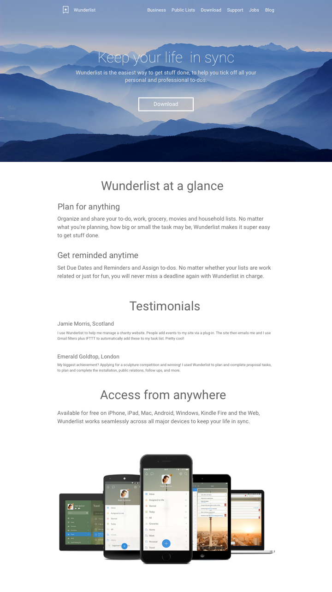

# Sike Design Note

Study design and sketch follow tutorial in [sike.io](http://sike.io/).

## Samples

## Note

### Start

2015/9/13

热身：<http://webdesign.tutsplus.com/tutorials/design-a-material-inspired-mobile-login-form-in-sketch--cms-23042>

快捷键：R 插入距形，T 插入文字，A 插入 ArtBoard

### 第一课

2015/9/19

- `cmd + 1` 缩小工作区域
- `ctrl + l` 显示栅格 (Grid) Layout

排版品牌信息

内容较少时采用居中布局

同个 "组件" 里面的东西应该更靠近，不同类比的组件之间应该有更大距离。这是基本的视觉原则应用。

背景图片，700px 高。选择原则：

- 文案和图片最好有结合。
- 如果文案和图片没有直接关系，选个没有主题，相对抽象的或风景图片会比较好。例：海洋，天空，草原，夜景。
- 首选颜色较暗或较浅的图片，这样当文字为黑色或白色，无需太多处理，就可直接应用，也不会让文字看不清楚。
- 避免图片中颜色有强烈对比，例如上黑下白之类的，会让你摆放文字时很纠结。
- 图片颜色较少为好，太花的照片往往不适合做背景，容易分散注意力、让画面显得乱。
- 裁切图片 (使用 mask)，调整亮度。

三分法构图

字体，使用现代字体，无衬体，不要超过三种

主标题细，副标题粗

极简按钮

商标和导航，导航右对齐

总结：

1. 排版
1. 背景
1. 构图
1. 字体

### 第二课：文字排版

2016/2/7

字号 / 行宽 / 行高 / 段落间隔

不同的元素不同的字号

选个不长不短的行宽 (一行太长会令人读起来喘不过气)

选个合适的行高 (太小的行高，令文字密密麻麻)

- 字号选哪些？
- 行宽 / 行高怎么定?
- 网格怎么设定?

base 16px， 1.5 rate。16~24px 适合阅读。

除了字号，使用不同粗细，不同灰度，对齐。

练习：

1. 套用字号层级
1. 行高和行宽
   - 正文的行高一般是字号的 1.5 倍 (这意味着单倍行距)
   - 标题的行高一般是字号 1.2 倍
   - 16/24 的意思是，用 16 号字号，行高是 24

打卡后看评论： <http://bbs.sike.io/t/lesson-2/866/39> (貌似网站已经不存在了)

字体的选择：

- 中文的话没选择。就用 hiragano，微软雅黑；
- 英文的话就像我们课程说的，选用 Lato，Roboto，Avenir Next 这些。

### 第三课：栅格排版

2016/2/8

学习内容：整个页面的基本排版

一个真正的 App 推广页面 （Landing page）需要提供更多的信息：

1. 产品截图和介绍
1. 功能列表
1. 用户评价
1. 团队介绍
1. 联系方式
1. 等等

最后一个例子很好。

排版原则：

1. 亲密性: 这只是一个很简单的原则, 把含义相关的东西放靠近一点。
1. 对齐: 建立一套栅格或网格；对齐可以选择左右对齐或者居中对齐。但你应该避免在一个小的区域内混搭不同的对齐方式。
1. 重复: 重复的同类内容，使用统一样式
1. 对比: 对比是由颜色、大小、粗细、间距等这些基本变化合力形成的。视觉变化让你更容易去分辨出含义不一样的元素。

练习:

1. 截屏和主要功能介绍: 我们采用常见的一左一右分布的模式。这就是一个很好的重复与变化配合的例子，宽度、间距、字体样式等都一致，通过改变左右顺序营造的节奏感，让设计不会枯燥乏味。
1. 全平台展示: 居中

功能列表展示:

1. 图标在左, 内容左对齐
1. 图标居中, 内容居中

总结万千个网站常见的版块，排版无非那么几种：

- 文字统一居中对齐或左对齐；
- 左对齐的时候，图标是在上边还是左边；
- 两列、三列、四列排布，四列以上太窄了不常见；
- 图标或大、或小。

练习:

1. 用户评价
1. 伙伴商标

### 第四课、细节抛光

2016/2/9

选择一个主题色: 建议刚开始的时候只使用一个主题色

第一印象背景图配色，建议选一个比较暗的图当背景，黑色百搭；另一个作法是修图，把背景图的色调改成和主题色一样。

如何用透罩把任何一张图片修成和主题色匹配的色调：

1. 用接近品牌主色的透明遮罩，让整个页面色调更鲜明

   在图片之上加一个矩形，fill 设为品牌主色, 调整 opacity

1. 如果单纯为了提高文字可读性，可以选择黑色或白色的透明遮罩

   - 白色文字看不清楚用黑色半透明加深照片颜色。
   - 黑色文字看不清楚用白色半透明让照片颜色变淡。

1. 对于照片色彩过于鲜明，可以采化降低图片饱和度，使之黑白化，再加上主题色透明遮罩。

调整功能介绍和截屏

区域的背景变化：

1. 浅灰背景色
1. 灰色渐变背景
1. Pattern 背景
1. 背景图

浅灰背景色：色值不要深于 #EEEEEE, 在 #F6F6F6 ~ #FCFCFC 之间为好。

Pattern 背景之上再加一层白色半透明渐变遮罩，就可以实现渐变的 Pattern 背景。

换上深色背景版块：

1. 避免重复交替深浅背景：两个深色背景版块之间应该要有多个浅色背景版块
1. 避免连续出现两个照片背景
1. 深色背景不要太多

深色背景的形式：

1. 纯色背景
1. 渐变色背景
1. 图片背景

图标装饰的几种方法：对齐 - 居中，左对齐，其它。

图标本身的装饰:

1. 不加装饰
1. 圆形线框装饰
1. 圆形背景色装饰
1. 用主色给图标上色

总结：好的设计是减法

1. 字体只用一种
1. 颜色只用一种主色
1. 线条、背景、花纹用几乎看不到的灰色

### 第五课、响应式设计

2016/2/9

移动 Web Vs 原生 App：多发挥 web 的优势，避免模仿 app 的特性。

什么是 Web 的特性?

- App 的设计的出发点是仪表板。仪表板注重 "操作"，各个组件呈现数据，驱动你和它互动。"方便" 是最重要的设计目标。
- Web 设计的出发点是传统印刷。印刷排版注重的是信息结构，整理归纳大量的信息。“清楚” 是最重要的设计目标。

响应式栅栏

- 保持 12 栅栏，可以分为 2，3，4，6 等份
- 限制一个最大宽度，以免太宽破坏排版，1240px 是个常见的最大值
- 避免使用固定的宽度

为不同设备设定栅栏

- PC 端: 总宽度 1240px, 居中, 间隔 30px，自动计算出栅栏宽度
- Mobile 端: 只用 6 栏, 320px，间隔 10px，自动计算出栅栏宽度

练习

响应式布局，不外就是 3 种方法：

1. 随着屏幕调整元素宽度。
1. 随着屏幕宽度提供的空间切换布局。
1. 屏幕空间不够的话隐藏非必要的元素。

左右布局对屏幕宽度要求较高，在窄屏下改为上下布局。

响应式案例分析 (PC —> Mobile 的变化)

1. 将导航隐藏到菜单中。更好的做法是选 3~4 个重要的链接显示出来，其余放在”更多”的链接中，比如 google 在 mobile 上的做法。
1. 横向布局改成垂直布局

一些坑

1. 背景图裁切，在 PC 是 Landscape，在 Mobile 上如果缩放效果不好，可改成 Portrait
1. 正文字号 (14~18) 可以通用，大标题字号在 Mobile 上可能要适当缩小
1. 在 Mobile 上缩小留白，两边稍微留一点空白就行
1. 长度不一的文本独立一行

done!
